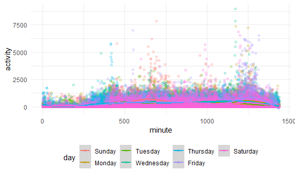
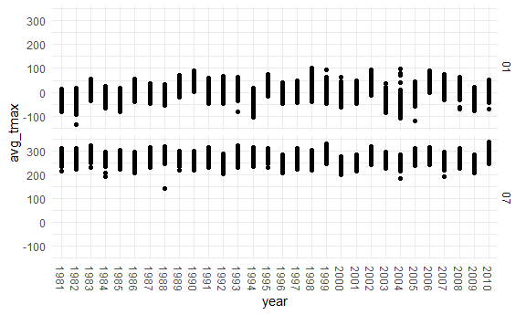
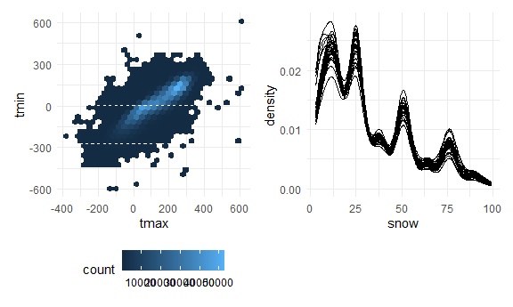

p8105\_HW3\_acn2138
================

Amanda Nagle’s HW 3

# Problem 1

Importing and cleaning the instacart dataset.

``` r
library(tidyverse)

theme_set(theme_minimal() + theme(legend.position = "bottom"))

knitr::opts_chunk$set(
  fig.width = 6,
  fig.asp = .6,
  out.width = "90%")

library(p8105.datasets)
data("instacart")
```

The data in the instacart dataset has one row per item in customer
order, with customer and order variables. It has 1384617 and 15 columns.

``` r
items_from_aisle = instacart %>%
                   count(aisle) %>%
                    arrange(desc(n))

aisle_plot = items_from_aisle %>%
 filter(n > 10000) %>%
  mutate(
    aisle = factor(aisle),
    aisle = fct_reorder(aisle, n)
  ) %>%
  ggplot(aes(x = aisle, y = n)) +
  geom_point() +
  theme(axis.text.x = element_text(angle = 270, vjust = 0.5, hjust = 1))

plot(aisle_plot)
```


Making a table:

``` r
instacart %>%
  filter(aisle %in% c("baking ingredients", "dog food care", "packaged vegetables fruits")) %>%
   group_by(aisle) %>%
  count(product_name) %>%
  mutate(rank = min_rank(desc(n))) %>%
  filter(rank < 4) %>%
  arrange(aisle, rank) %>%
  knitr::kable()
```

| aisle                      | product\_name                                 |    n | rank |
| :------------------------- | :-------------------------------------------- | ---: | ---: |
| baking ingredients         | Light Brown Sugar                             |  499 |    1 |
| baking ingredients         | Pure Baking Soda                              |  387 |    2 |
| baking ingredients         | Cane Sugar                                    |  336 |    3 |
| dog food care              | Snack Sticks Chicken & Rice Recipe Dog Treats |   30 |    1 |
| dog food care              | Organix Chicken & Brown Rice Recipe           |   28 |    2 |
| dog food care              | Small Dog Biscuits                            |   26 |    3 |
| packaged vegetables fruits | Organic Baby Spinach                          | 9784 |    1 |
| packaged vegetables fruits | Organic Raspberries                           | 5546 |    2 |
| packaged vegetables fruits | Organic Blueberries                           | 4966 |    3 |

Apples v Icecream

``` r
instacart %>%
  filter(product_name %in% c("Pink Lady Apples", "Coffee Ice Cream")) %>%
  group_by(product_name, order_dow) %>%
  summarize(mean_hour = mean(order_hour_of_day)) %>%
  pivot_wider(
    names_from = order_dow,
    values_from = mean_hour
  )
```

    ## `summarise()` regrouping output by 'product_name' (override with `.groups` argument)

    ## # A tibble: 2 x 8
    ## # Groups:   product_name [2]
    ##   product_name       `0`   `1`   `2`   `3`   `4`   `5`   `6`
    ##   <chr>            <dbl> <dbl> <dbl> <dbl> <dbl> <dbl> <dbl>
    ## 1 Coffee Ice Cream  13.8  14.3  15.4  15.3  15.2  12.3  13.8
    ## 2 Pink Lady Apples  13.4  11.4  11.7  14.2  11.6  12.8  11.9

# Problem 2

Importing and tidying the accelerometer data.

This dataset contains one row for ever entrance/exit in the NYC subway
system. The important variables are the line name and station name
because these allow the user to understand subway stations. The routes
are important to understand which trains stop at the station.

``` r
accelerometer_data = read_csv(file = "./data/accel_data.csv") %>%
                    janitor::clean_names()  %>%
                    pivot_longer(activity_1:activity_1440,
                                 names_to = "minute",
                                 names_prefix = "activity.",
                                 values_to = "activity") %>%
                    mutate(weekday = ifelse(day %in% c("Saturday", "Sunday"), "weekend", "weekday"),
                           day = factor(day,
                                        levels= c("Sunday", "Monday", 
    "Tuesday", "Wednesday", "Thursday", "Friday", "Saturday")),
                            day_id = as.factor(day_id),
                            minute = as.numeric(minute)) %>%
                    arrange(day)
```

The accelerometer data is now tidy with 50400, one for each minute of
each day for 35 days. There are 6 columns, one for the week, the numeric
day starting at the first day, the day of the week the minute of the
day, the amount of activity, and if it is a weekend or a weekday.

Creating table of day totals:

``` r
one_day_row = accelerometer_data %>%
  group_by(week, day) %>%
  summarize(total_activity= sum(activity)) %>%
  arrange(week, day) 
  
wider = one_day_row %>%
  pivot_wider(names_from = day, values_from = total_activity) 
  
knitr::kable(wider)
```

| week | Sunday |    Monday |  Tuesday | Wednesday | Thursday |   Friday | Saturday |
| ---: | -----: | --------: | -------: | --------: | -------: | -------: | -------: |
|    1 | 631105 |  78828.07 | 307094.2 |    340115 | 355923.6 | 480542.6 |   376254 |
|    2 | 422018 | 295431.00 | 423245.0 |    440962 | 474048.0 | 568839.0 |   607175 |
|    3 | 467052 | 685910.00 | 381507.0 |    468869 | 371230.0 | 467420.0 |   382928 |
|    4 | 260617 | 409450.00 | 319568.0 |    434460 | 340291.0 | 154049.0 |     1440 |
|    5 | 138421 | 389080.00 | 367824.0 |    445366 | 549658.0 | 620860.0 |     1440 |

This table is informative, but to see trends by day of the week, I also
made the table below.

``` r
one_day_row %>% 
  group_by(day) %>%
  summarize(mean_activity = mean(total_activity)) 
```

    ## `summarise()` ungrouping output (override with `.groups` argument)

    ## # A tibble: 7 x 2
    ##   day       mean_activity
    ##   <fct>             <dbl>
    ## 1 Sunday          383843.
    ## 2 Monday          371740.
    ## 3 Tuesday         359848.
    ## 4 Wednesday       425954.
    ## 5 Thursday        418230.
    ## 6 Friday          458342.
    ## 7 Saturday        273847.

From this summary table we can see that Fridays have the most activity,
on average.

Making visualization for day of week

``` r
daily_plot = accelerometer_data %>%
  group_by(day_id) %>%
  ggplot(aes(x = minute, y = activity, group = day, color= day)) +
  geom_point(alpha=.2) +
  stat_smooth()

plot(daily_plot)
```


Because the time granules are so small, the scatter plot is not idea to
look at by itself, so I added a smoothed line showing the mean activity
at each minute by day of the week.

From the second graph, we can see that this man does not domuch activity
before 8:00, with a few exceptions on Thursdays. He is also most active
on any day just after 8 pm. He is most active in the evening on Fridays.

# Problem 3

Importing and cleaning the NY NOAA data.

``` r
library(p8105.datasets)
data("ny_noaa") 
            
summarize(ny_noaa, mean(tmax, na.rm=true))
```

    ## # A tibble: 1 x 1
    ##   `mean(tmax, na.rm = true)`
    ##                        <dbl>
    ## 1                         NA

``` r
cleaned_noaa_data = ny_noaa %>%
  separate(date, c("year", "month", "day"), sep = "-") %>% 
  mutate(prcp = prcp*10, tmax = as.numeric(tmax), tmin = as.numeric(tmin))

#summarize(cleaned_noaa_data, mean(tmax, na.rm = TRUE))
  
  #mode snowfall 
cleaned_noaa_data %>%
  mutate(chr_snw = as.character(snow)) %>%
  count(chr_snw) %>%
  arrange(desc(n))
```

    ## # A tibble: 282 x 2
    ##    chr_snw       n
    ##    <chr>     <int>
    ##  1 0       2008508
    ##  2 <NA>     381221
    ##  3 25        31022
    ##  4 13        23095
    ##  5 51        18274
    ##  6 76        10173
    ##  7 8          9962
    ##  8 5          9748
    ##  9 38         9197
    ## 10 3          8790
    ## # ... with 272 more rows

The New York NOAA data is a subset of the National Oceanic and
Atmospheric Administration’s database of data from weather station. It
has2595176 rows of data. The columns are id, date, prcp, snow, snwd,
tmax, tmin, where prcp is precipitation and snwd is snow depth. tmax and
tmin are missing for much of the data set, which is concerning.

Snowfall and snow depth are measured in mm. Precipitation was recorded
in 10ths of mms, but was edited to me mm to be consistent with the other
two measures.

The most common snowfall measure was 0 inches and second was NA. 0
snowfall makes sense as it only snows in New York in the Winter. The NA
values requires further investigations. These NA days should perhaps be
coded as 0s

``` r
temp_plot = cleaned_noaa_data %>%
  filter(month == "01" | month == "07") %>%
  group_by(month, year, id) %>%
  mutate(avg_tmax = mean(tmax, na.rm = TRUE, group = month)) %>%
  ggplot(aes(x=year, y=avg_tmax)) +
    geom_point() +         
    facet_grid(month ~ .)+
    theme(axis.text.x = element_text(angle = 270, vjust = 0.5, hjust = 1))

plot(temp_plot)
```

    ## Warning: Removed 185070 rows containing missing values (geom_point).


Generally, January has colder temperatures than July. July of 1988 did
have one station that was much colder than the others, but generally,
the stations have temps similar to one another.

tmax v tmin

``` r
library(plotly)
```

    ## 
    ## Attaching package: 'plotly'

    ## The following object is masked from 'package:ggplot2':
    ## 
    ##     last_plot

    ## The following object is masked from 'package:stats':
    ## 
    ##     filter

    ## The following object is masked from 'package:graphics':
    ## 
    ##     layout

``` r
library(patchwork)

tmax_plot = cleaned_noaa_data %>%
    ggplot(aes(x=tmax, y= tmin)) +
    geom_hex()

snow_plot = cleaned_noaa_data  %>%
  filter(snow<100) %>%
  filter(snow>0) %>%
  group_by(year) %>%
  ggplot(aes(x=snow, group = year)) +
  geom_density()

plot(tmax_plot + snow_plot)
```

    ## Warning: Removed 1136276 rows containing non-finite values (stat_binhex).


